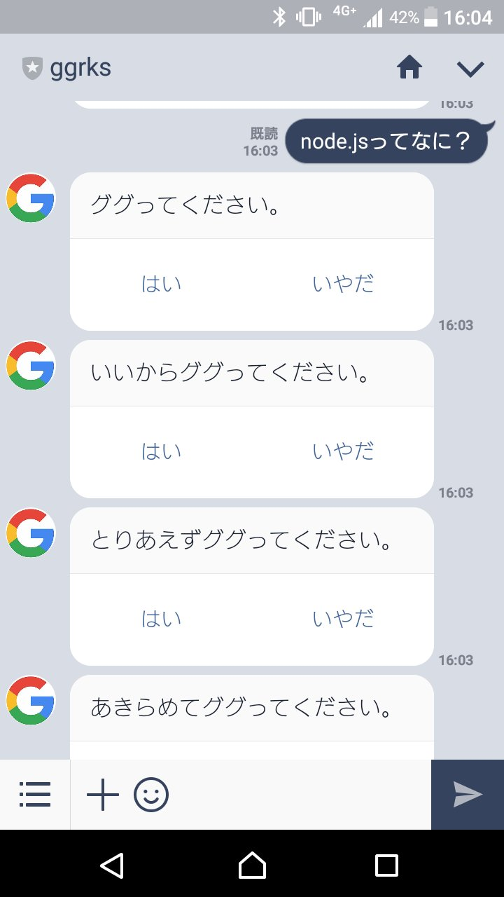

# ggrks LINE BOT

Q. ggrks BOTって何？

A. ググってください。

Q. いいえ

A. いいからググってください。

Q. いいえ

A. とりあえずググってください。

Q. いいえ

A. あきらめてググってください。

Q. はい

A. http://google.com/search?q=ggrks%20BOT%E3%81%A3%E3%81%A6%E4%BD%95%EF%BC%9F

## で、何？
LINEのBOTです。
[東京Node学園祭2017](http://nodefest.jp/2017/)の[LINE BOTを作るハンズオン](https://qiita.com/n0bisuke/items/ceaa09ef8898bee8369d)の中で作りました。

以下のQRコードから試せるかもしれません。

## 動かすためには？
環境変数に以下の二つをセットして `npm start` すれば動くかもしれない。

- LINE\_ACCESS\_TOKEN
- LINE\_CHANNEL\_SECRET
